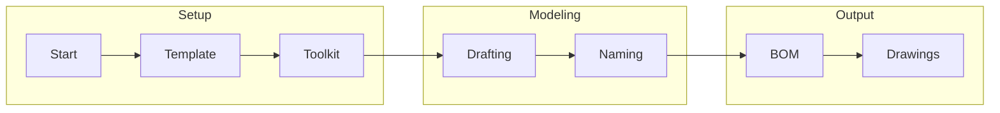
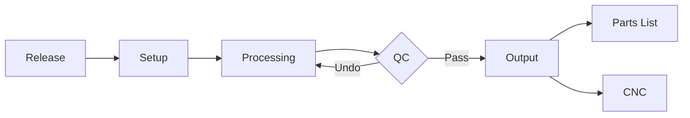

# Project Delivery Overview – Engineering Workflow

> **Related Documents**: [Engineering Roles](/overview/engineering-roles.html) | [FE Workflow](/workflows/fabrication-engineer.html) | [PE Workflow](/workflows/production-engineer.html) | [FE to PE Release](/workflows/fe-to-pe-release.html)

This document provides a high-level overview of the complete engineering workflow from project assignment through closeout.

## Workflow Visualization

## Phase 1: Project Assignment & Initial Setup (Pre-Contract & Design Engineering Initiation)

### Engineering receives a new scope of work

*   FEs check assignments via Epicor → Submittal Dashboard
    
*   Clocking into jobs:
    
    *   General: PROJ.ENG (Design, Fabrication, Coordination, Meetings)
        
    *   Specific: E1085.015 Submittal
        

### Access project files

*   "AWARDED" → "1234\_SOME PROJECT NAME" → "03 ENGINEERING"
    

### Retrieve incoming documents from 01\_INCOMING\_Documents

*   00\_Contract\_Drawings\_from\_Precon
    
*   01\_Addendum\_Drawings\_Post\_Contract
    
*   02\_Working\_Set
    
*   03\_Spec\_Sheets ("Cut Sheets")
    
*   04\_Coordination\_Documents (AdjacentSub, Laser Scans)
    

### Rhino Template Setup

*   Pull from internal templates → Save to 02\_WORKING\_Drawings\_Models/01\_FE\_Models/PROJ.JOB\_ScopeDescription
    
*   Rename: 1094.002\_FE\_Cache
    

### Design Engineering (DE) Phase

*   Convert approximate geometries → precise geometries
    
*   Develop build strategies, assembly details, and SKs for client review
    
*   Use nominal dimensions pre-contract award
    

## Phase 2: Fabrication Engineering (FE) – Core Work

### Toolkit & Setup

*   Launch Engineering Toolkit (Grasshopper)
    
*   Log into Epicor via toolkit
    
*   Pull DFW/CW payload
    
*   Restore model/layout space
    
*   Control drawing variables (project, job, client, quantity, date, initials)
    
*   Populate Project (T00) and Schedules (G00) pages
    

### Modeling Standards & Drafting Standards

*   Use parent layers: CWKA-PRECON, CWKA-DE, CWKA-FE, CWKA-PE
    
*   Sublayers: IN-2D, IN-3D, CON, PUR, MFG
    
*   Drawing geometry → 00\_CWKA-DWG layer
    

### Material Tagging

*   Format: MaterialCode## (e.g., PLY01)
    
*   Entered in Project Transmittal Log
    

### Scribes & Named Positions

*   Copy finished geometry → CWKA-PE > REF
    
*   Use Named Positions for exploded views
    

### Referencing Geometry

*   Use Insert → Linked → Layer style: Active
    
*   Choose:
    
    *   Block Instance for fixed geometry
        
    *   Individual Objects for editable parts
        

### Sections & Hatches

*   Use Rhino 8 clipping plane tool
    
*   Hatch settings:
    
    *   Pattern: per material
        
    *   Color: black
        
    *   Background: white
        
    *   Scale: 3–5
        
    *   Rotation: adjustable
        

### Manufactured Parts (MFG)

*   Naming: ProjectNumber.MFGCode.PartNumber (e.g., 1001.WC.00001)
    
*   Types: linked blocks, embedded blocks, or layer-integrated
    

### Material Thickness

*   Nominal thickness (e.g., ¾" plywood = 0.73")
    
*   Solid wood: design thickness
    

### Lay-up Material Code

*   Format: PRE\_438\_331\_7\_19 → used as layer name
    

### Solid Body Parts

*   Must be closed, manifold polysurface
    
*   Includes faces, backers, edgebanding
    
*   Exceptions: post-lam, curved/notched edges
    

### Part Sizing

*   Fit within BOM'd material
    
*   Adjust for sheet sizes (e.g., 4'x8', 4'x10')
    

### Painted MDF

*   Apply paintable edgebanding if edges exposed
    

### Part Naming & BOM

*   Assign Shipping Component numbers (e.g., SC005)
    
*   Use Modeling Toolkit:
    
    *   Generate part names
        
    *   Store attributes: thickness, length, width, depth, area, volume
        
    *   Ensure correct naming format
        
*   BOM material & hardware in Epicor
    
*   Use auto-BOM feature:
    
    *   Refine with scrap %
        
    *   Export for Epicor
        
*   Nesting:
    
    *   1D for sticks
        
    *   2D for sheets
        
*   Export Master Parts List (Excel)
    

### Shop Drawings & Submittal

*   Finalize drawings with material, hardware, size, strategy
    
*   Save in 03\_OUTGOING\_Submittals
    
*   Submit to Project Advisor (PA) via Approvals app in Teams
    
*   Naming: PROJ.JOB\_ScopeDescription
    
*   Attach: BOX.com link to internal review PDF
    
*   PM → PA approval flow
    
*   PM adds Bluebeam comments
    
*   Approved PDF → 01\_Outgoing folder
    
*   Track status in Epicor → "Production Report"
    

### Solid Wood Components (WC Jobs)

*   Lookup next WC number
    
*   Set UOM: EA or LF
    
*   Create 1-page WC drawing
    
*   BOM WC part to job
    
*   Request WC job via CWKA Forms Team
    
*   Notify Production Planner if quantity changes
    

### Epicor Updates

Check:

*   "Engineering Complete"
    
*   "Field Dimensions Received"
    
*   "Shop Drawings Approved"
    
*   "BOM Complete"
    

## Phase 3: FE Release to Production Engineering (PE Handoff)

> **For detailed step-by-step instructions, see** [FE to PE Release Step by Step SOP](/workflows/fe-to-pe-release.html)**.**

Ensure:

*   All material/hardware/vendor work BOM'd, ordered, received
    
*   All parts named correctly
    
*   Redlines picked up
    
*   Finalized shop drawings
    

Prepare Excel list of Shipping Components (SCs) Create clean PE file Check job is "Released in Epicor" Post release in CO Production Eng chat with file links

Place:

*   Shop drawings → Production\_Drawings
    
*   SC file → Production\_Files
    
*   WC drawings → Box folder → Epicor → chat post
    

## Phase 4: Production Engineering (PE) Phase

*   Access job folder → Copy & rename template folders
    
*   Place PE Rhino file & SC list in Production Files
    
*   Copy & rename:
    
    *   Master Parts List template
        
    *   Lay-Up Summary template
        
*   Create SHOP model (purge FE geometry)
    
*   Layer: 04\_CWKA-PE > MACHINING
    
*   Use GH scripts:
    
    *   Lay Flat, Open Nest, Sheet Pairing, Geometry Creation
        
    *   Part List, Sheet Name Text, Part Name Text, SK Creation
        
*   Check model:
    
    *   Material layers, named parts, duplicates, bad objects
        
    *   Open polysurfaces, scribes, quantity match, machining
        
*   Create:
    
    *   Master Parts List (no MT parts)
        
    *   Hardwoods List
        
    *   Lay-Up Summary (if needed)
        
*   Place:
    
    *   Shop drawings, CNC SKs, WATERJET SKs → Production Drawings
        
    *   Mastercam files → Mastercam Files
        
    *   Rhino exports → Rhino Files
        
    *   Posted programs → machine folders
        
*   Program machines (Mazak, Weeke)
    
*   Check "Programming complete" in Epicor
    

## Phase 5: Project Closeout (Samples)

*   PM completes Sample Request form
    
*   BOM nonstandard substrate → SMP job → mark "RTP"
    
*   Scheduler/PE prints Epicor Job Traveler
    
*   Finish Dept creates samples
    
*   PM scans samples → saves in project folder
    
*   PM completes Letter of Transmittal → sends to Shipping Manager
    
*   Track approval → update TRA log & Epicor status
    
*   Mark SMP job as "Production Complete" in Epicor