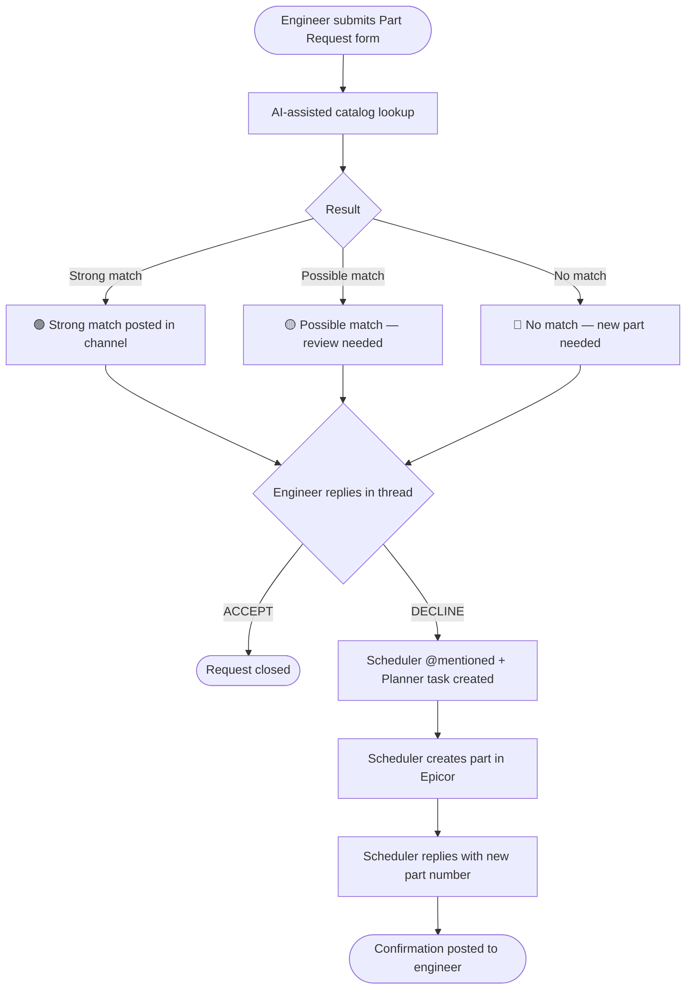

# Part Requests

The Part Requests workflow handles global material part lookups and new part creation through the **Part Requests** channel in Teams. Submit a form, review the AI-assisted result in the channel, and reply with one word — the system routes the rest.

> **Related**: [Engineer / PM Guide](/tools/releases-and-requests/part-requests/engineer-guide.html) | [Scheduler Guide](/tools/releases-and-requests/part-requests/scheduler-guide.html) | [Part Management](/tools/epicor/part-management.html) | [Reverse Lookup](/workflows/fabrication-engineer/toolkit/modeling.html#how-to-reverse-lookup)

## Workflow Overview

## Who Does What

| Role | Responsibilities |
|---|---|
| **Engineer / PM** | Submits the form; reviews the channel result; replies ACCEPT or DECLINE |
| **Scheduler** | Receives DECLINE notifications; creates new parts in Epicor; replies with confirmed part number |

See the [Engineer / PM Guide](/tools/releases-and-requests/part-requests/engineer-guide.html) or [Scheduler Guide](/tools/releases-and-requests/part-requests/scheduler-guide.html) for step-by-step instructions.
