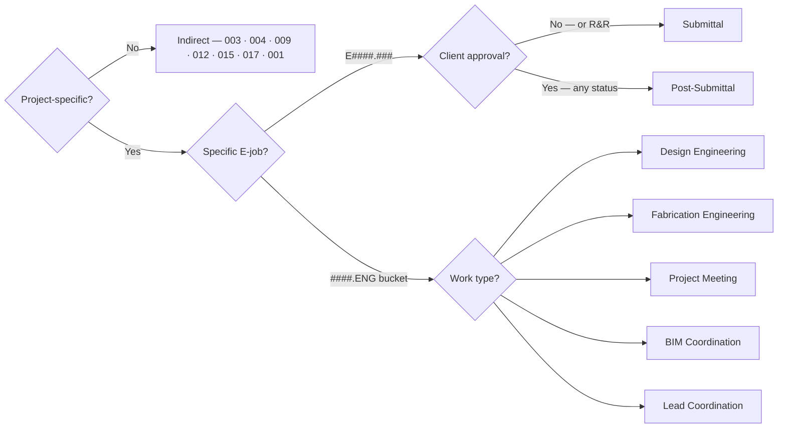

# Time Entry

> **Related Documents**: [Epicor Usage](/tools/epicor/)

This document covers time entry procedures using both Epicor and Toggl for Engineering staff.

## Deadlines

All time for the week must be fully entered in Epicor by **EOD Friday (6pm EST)**. A department reminder is sent at 6pm EST each Friday.

- **Best practice**: Enter time at EOD every day — don't let it accumulate.
- **PTO / sick days**: Enter your time before you leave. Do not assume you'll catch up Monday.
- **Weekend work**: Any time worked over the weekend must be entered before the start of work **Monday (9am EST)**.

> The previous Monday 12pm EST deadline has been retired. Friday EOD is the new standard.

## How do I clock into a job using Office MES?
{: #how-to-clock-in-mes}

Office MES → **Start Production** (manufacturing jobs) or **Start Indirect** (bucket jobs) or **Start Rework**. Search for the job, select the operation, and clock in. End the activity and add a labor note when done.

## How do I record rework time?
{: #how-to-record-rework}

Office MES → **Start Rework** (same job pool as production, flagged differently in backend). In Time and Expense Entry, check the Rework box and select Machine Error, providing a quick description.

## Time Codes

### Indirect Entries
Used for time not billable to a specific project.

- **IND General Indirect**
- **001** Sales Engineering, (for assigned engineering work for projects not under contract)
- **003** Training (applies to both trainer and trainee, time spent improving workflow/skills)
- **004** Company Meetings, (for large group meetings that are not project specific)
- **005** Holidays DO NOT USE
- **006** PTO DO NOT USE
- **008** Break Time (15 min breaks only, DO NOT INCLUDE LUNCH)
- **009** ENG Assistant, (for support role duties - printing travelers, entering part names, etc)
- **012** ENG Dept Improvement (for assigned development of departmental assets)
- **015** Machine Maintenance (fixing computer problems >15 min)
- **017** ENG Administration (for roles overseeing operations/administrative duties like Project Advisor)

## Production Entries (Bucket Jobs)

For direct labor that applies project-wide, not job-specific. See the [Operation Selection Guide](#operation-selection-guide) for full definitions and boundary rules.

**Example Job Name**: `1234.ENG`

- Design Engineering
- Fabrication Engineering
- Lead Coordination
- Project Meetings
- BIM Coordination

**Note**: If your name isn't under resource, change Resource Group in Time and Expense Entry.

## Production Entries (Job Specified)

For direct labor on specific jobs. See the [Operation Selection Guide](#operation-selection-guide) for full definitions and boundary rules.

### FE Example Job Name: `E1234.123`
- Submittal (drawing/modeling prior to client approval)
- Post-Submittal (modeling/drawing after client approval, prior to PE Release)

### PE Example Job Name: `1234.123`
- Prod Engineering (reviewing, programming, reworking jobs)

---

## Operation Selection Guide
{: #operation-selection-guide}

Choosing the correct operation matters — project labor reports and change order back-calculations depend on entries being classified accurately. Use this guide when you are unsure where time belongs.

### Labor note requirements
{: #labor-note-requirements}

- **Indirect entries**: A labor note is **required** on every entry.
- **Direct entries**: A labor note is **strongly preferred**. Labor notes on direct time are the primary input for back-calculating engineering costs on change orders — a blank note is a lost data point.
- **Office MES users**: Small **IDLE TIME** entries (≤ 5 minutes) are auto-generated by the system between task switches. These are normal and approved — no action needed.

### Direct operations — FE jobs (`E####.###`)
{: #direct-fe-jobs}

**Submittal**
All FE modeling and drawing work prior to client approval. Covers model building, drawing layouts, and shop drawings from start through issuance of the submittal package. If you receive redlines and are revising before an approval decision is issued, remain on Submittal.

**Post-Submittal**
All FE modeling and drawing work after the client issues an approval — Approved, Approved as Noted, Approved with Comments, or Approved with Corrections. Covers redline incorporation, PE release prep, install drawings, and the final release file. The switchover is triggered by the client's approval response, not by your internal decision to start PE prep.

> "Revise and Resubmit" is not an approval — remain on Submittal. Any approval status (even conditional) triggers the switch to Post-Submittal.

### Direct operations — PE jobs (`####.###`)
{: #direct-pe-jobs}

**Prod Engineering**
All PE work on a specific job after FE release: reviewing the handoff file, programming, CNC setup, rework oversight, and post-release job coordination.

### Direct operations — ENG bucket (`####.ENG`)
{: #direct-eng-bucket}

**Design Engineering**
Two categories of work belong here:

1. **Early-phase exploratory work** before a specific E-job exists: design modeling, panelization studies, geometry research, scope intake, and concept development.
2. **System-wide procedural generation scripting** for a project — Grasshopper scripts that drive geometry across the project scope. This applies regardless of whether E-jobs are active and can represent a substantial share of the engineering budget on scripted or parametric projects.

> Once you are building a submittal model on a specific E-job, that model work moves to Submittal on that job. Scripting that spans the whole project scope remains on Design Engineering.

**Fabrication Engineering**
FE-scope work on the bucket job that spans multiple jobs or cannot be cleanly assigned to a single E-job: group submittal takeoffs, BOMing across multiple scopes, redline review when coordinating across jobs, and shop drawings for subcontractors. If the work applies cleanly to one E-job, clock into that E-job instead.

**Lead Coordination**
Senior/lead-level coordination work that is neither a meeting nor direct production output: reviewing another engineer's submittal, scope review with the PM, preparing CAD or coordination files for third parties, laser scan processing, WC/PLAM/veneer part creation in a coordination capacity, and mentoring on standards or procedures.

**Project Meeting**
Any meeting with a client, GC, design team, or external partner on a specific project. Internal project team standups and weekly project calls also belong here. Clock into the ENG bucket job for that project (`####.ENG`).

**BIM Coordination**
Coordination involving the BIM model or third-party BIM, MEP, or lighting consultants — including file conversions for BIM handoffs and lighting takeoffs performed in a BIM coordination context. Standard BOM work and job creation requests do not belong here.

### Indirect operations
{: #indirect-operations}

**General Indirect (IND)**
Overhead time with no better home. Common valid uses:
- Non-project-specific email and correspondence
- Brief daily prep
- **Time entry administration** (for engineers not using Office MES): log as a standalone General Indirect entry with a note of "time entry." Should not exceed **45 minutes per week total.** Do not create multi-hour time entry entries — this is a signal that time is being deferred and entered in bulk, which defeats the purpose of labor notes.

**Company Meetings (004)**
Department-wide or company-wide meetings with no project-specific agenda: all-hands meetings, FE/PE schedule review calls, department Q&As, and 3-week outlook discussions when reviewing the queue as a whole. If a meeting involves a specific project's client, GC, or design team, use Project Meeting instead.

**Training (003)**
Any activity where the primary purpose is skill transfer, for both trainer and trainee: onboarding, software walkthroughs, Rhino/Epicor training, and standards reviews.

**ENG Dept Improvement (012)**
Assigned development of department assets: Engineering Toolkit work, plugin and script development, PE checklists, SOP writing, hardware library updates, and new machine setup and qualification. Work should be manager-sanctioned before logging here.

**Machine Maintenance (015)**
Computer and software issues that interrupt work, threshold > 15 minutes: software installation for a new workstation, VPN troubleshooting, Rhino/GH plugin installs, and virus protection issues. Routine updates and brief restarts under 15 minutes do not qualify.

**ENG Administration (017)**
Project Advisor (PA) role duties: PA consults, PA job reviews, post-mortem coordination, and managing engineering operations. Reserved for staff performing PA or administrative oversight functions.

**Eng Assistant (009)**
Support role duties: Epicor part creation, job creation, job scheduling, traveler printing, and part name entry.

**Sales Engineering (001)**
Engineering work performed for projects not yet under contract. Use when assigned to pre-contract scope development.

### Common misclassifications
{: #common-misclassifications}

| Situation | Incorrect | Correct |
|---|---|---|
| Redline revision after client approval | Submittal | Post-Submittal |
| Parametric/GH scripting spanning the project | Submittal or Fab Engineering | Design Engineering |
| Work on a single specific job | Fab Engineering (bucket) | Submittal or Post-Submittal on that E-job |
| Internal all-hands or department schedule review | Project Meeting | Company Meetings |
| Project-specific daily standup | Company Meetings | Project Meeting |
| GH plugin development or toolkit work | Company Meetings | ENG Dept Improvement |
| BOM work unrelated to BIM coordination | BIM Coordination | Fab Engineering |
| Time entry administration | (unlabeled General Indirect) | General Indirect, note: "time entry", max 45 min/week |

## Toggl Time Entry

For engineers not using Office MES, time entry is done via Toggl and exported to Epicor. See **[Toggl Setup & Upload](/tools/time-entry/toggl.html)** for installation, structure, and the Epicor upload procedure.

