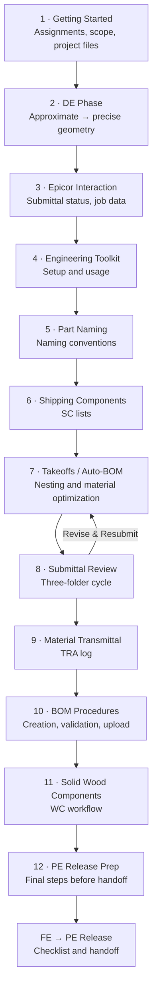

# Fabrication Engineer (FE) Workflow

Complete workflow for Fabrication Engineers from project assignment through PE release.

> **Related Documents**: [Project Delivery Overview](/onboarding/project-delivery.html) | [FE to PE Release](/workflows/fe-to-pe-release.html) (checklist and procedure)

## Workflow Overview

The FE workflow consists of these key phases:

1. **[Getting Started](/workflows/fabrication-engineer/getting-started.html)** - Finding assignments, verifying scope, and setting up project files
2. **[Design Engineering (DE) Phase](/workflows/fabrication-engineer/design-engineering.html)** - Converting approximate geometry to precise fabrication-ready models
3. **[Epicor Interaction](/workflows/fabrication-engineer/epicor-interaction.html)** - Updating submittal status and managing job data
4. **[Engineering Toolkit](/workflows/fabrication-engineer/toolkit/)** - Setting up and using the FE toolkit
5. **[Part Naming](/workflows/fabrication-engineer/part-naming.html)** - Naming conventions and procedures
6. **[Shipping Components](/workflows/fabrication-engineer/shipping-components.html)** - Creating and managing SC lists
7. **[Takeoffs](/workflows/fabrication-engineer/takeoffs.html)** - Auto-BOM, 1D/2D nesting, and material optimization
8. **[Submittal Review](/workflows/fabrication-engineer/submittal-review.html)** - Three-folder submittal review cycle
9. **[Material Transmittal](/workflows/fabrication-engineer/material-transmittal.html)** - TRA log structure and engineer responsibilities
10. **[BOM Procedures](/workflows/fabrication-engineer/bom-procedures.html)** - BOM creation, validation, and Epicor upload
11. **[Solid Wood Components](/workflows/fabrication-engineer/solid-wood-components.html)** - WC workflow from identification to release
12. **[PE Release Preparation](/workflows/fabrication-engineer/pe-release-prep.html)** - Final steps before releasing to PE (then complete [FE to PE Release](/workflows/fe-to-pe-release.html))
13. **[Troubleshooting](/workflows/fabrication-engineer/troubleshooting.html)** - Common issues and solutions

## Quick Links

- **New to FE?** Start with [Getting Started](/workflows/fabrication-engineer/getting-started.html)
- **Ready to release?** [PE Release Preparation](/workflows/fabrication-engineer/pe-release-prep.html) → [FE to PE Release checklist](/workflows/fe-to-pe-release.html#pre-release-checklist)
- **Having issues?** Check [Troubleshooting](/workflows/fabrication-engineer/troubleshooting.html)

## Related Resources

- [Epicor Usage](/tools/epicor/) - Detailed Epicor procedures
- [Rhino Drafting Standards](/standards/rhino-drafting/) - Drawing conventions
- [Layer Organization](/standards/layer-organization/) - Layer structure standards
- [Approvals Process](/tools/approvals-process.html) - Submitting for PA approval
