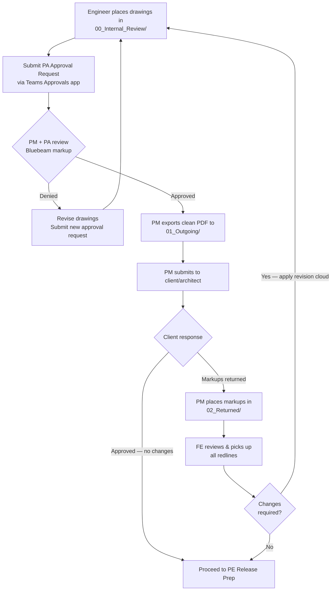

# Submittal Review Cycle

The three-folder workflow for submitting, reviewing, and revising shop drawings.

> **Related**: [Approvals Process](/tools/approvals-process.html) | [FE to PE Release](/workflows/fe-to-pe-release.html) | [Folder Structure](/reference/folder-structure.html)

## Overview

Completed shop drawings follow a three-folder workflow under `03_OUTGOING_Submittals/[PROJ.JOB_ScopeDescription]/`:

```
03_OUTGOING_Submittals/
  PROJ.JOB_ScopeDescription/
    00_Internal_Review/    ← Engineer places drawings here for QA
    01_Outgoing/           ← Clean PDFs sent to client
    02_Returned/           ← Architect markups returned for FE review
```



## Step-by-Step

### 1. Internal Review

- Place completed shop drawings in `00_Internal_Review/`.
- Submit a [PA Approval request](/tools/approvals-process.html) via the Teams Approvals app, attaching a Box link to the internal review PDF.
- The PM reviews first, then the PA. Both add Bluebeam comments to the PDF.

### 2. Revise if Denied

If denied at either stage:
1. Pick up **all** Bluebeam comments from both PM and PA — see [Tracking Markup Pickup](#tracking-markup-pickup) below.
2. Revise the drawings.
3. Submit a **new** approval request (do not reuse the denied request).

### 3. Outgoing

After approval:
- The PM exports a **clean** (comment-free) PDF copy to `01_Outgoing/`.
- The PM submits the drawing package to the client/architect.

### 4. Returned

When the architect returns marked-up drawings:
- The PM places them in `02_Returned/`.
- The FE reviews all redlines and incorporates changes.
- If changes are required, the cycle repeats (revised drawings go back to `00_Internal_Review/`).
- Each client return cycle that results in a reissue constitutes one **revision** — apply revision clouds, symbols, notes, and update the titleblock revision log accordingly. See [Revision History](/standards/rhino-drafting/revision-history.html).

## Tracking Markup Pickup
{: #tracking-markup-pickup}

When working through internal or external redlines, every comment must receive a visible disposition — do not simply close the file once changes are made. This applies to PM/PA internal review comments and returned architect markups alike.

Each comment should be resolved in one of three ways:
- **Picked up** — change incorporated into the drawings
- **RFI** — insufficient information to act; flagged for clarification
- **Escalated to PM** — comment may warrant rejection or negotiation with the client

### Method 1: Highlighter

The simplest approach. Use the Bluebeam highlighter tool to mark each comment on the page as it is addressed. Fast and visually obvious when scanning the document.

### Method 2: Markup Status (Markups List)

The Markups List pane in Bluebeam Revu includes a **Status** field for each annotation. Assigning a status creates a logged record of how each comment was handled. Default statuses and their hotkeys:

| Status | Hotkey | Use |
|---|---|---|
| Accepted | `Shift+1` | Comment picked up and incorporated |
| Rejected | `Shift+2` | Comment rejected — escalate to PM |
| Cancelled | `Shift+3` | Comment no longer applicable |
| Completed | `Shift+4` | Action taken (broader than accepted) |
| None | `Shift+5` | Clear / reset status |

Either method is acceptable. What is not acceptable is working through a redlined set with no tracking at all — both for your own reference and so that the lead engineer or PM can verify completeness at a glance.

## Submittal Status Tracking

Track the **drawing package** submittal progress in the Epicor [Production Report](/tools/epicor/production-report.html). Update the "Submittal" status field as the package moves through the cycle:
- Internal Review
- Submitted
- Approved / Resubmitted

The same field is visible on the [Submittal Dashboard](/tools/epicor/dashboards.html#submittal-dashboard).

> **Note:** This tracks the drawing package as a whole — not individual material/finish approval status. Material and finish submittals are tracked separately in the [Material Transmittal Log (TRA)](/workflows/fabrication-engineer/material-transmittal.html).

## RFIs — Requesting Information from the Architect
{: #rfis}

During the engineering process, information gaps arise that cannot be resolved from contract documents alone. These are resolved through the **RFI (Request for Information)** process:

1. **FE identifies the gap** — Document the specific question, including the drawing reference and what information is needed.
2. **Submit to PM** — Route the RFI to the PM, not directly to the architect. PM writes, formats, and submits formal RFIs to the client/architect.
3. **PM tracks and returns** — PM monitors RFI status and communicates the architect's response back to the engineer.

> **Do not contact the architect directly.** All formal communication with the client or architect is managed through the PM. Informal technical conversations may occur in certain project contexts, but formal information requests always route through PM.

RFI status may be tracked in the Bluebeam markup log as described in [Tracking Markup Pickup](#tracking-markup-pickup).

## Scope Changes — PCO and Change Order Direction
{: #scope-changes}

When an architect's markup or project development reveals work that is outside the originally contracted scope, the engineering team does not independently respond to or absorb that scope.

1. **Flag to PM** — Immediately notify the PM when returned markups or other communications suggest a scope expansion or change.
2. **PM evaluates and initiates PCO** — The PM determines whether the item warrants a Potential Change Order (PCO) and initiates the process with the client.
3. **PM directs Engineering** — Engineering proceeds with the changed scope only after the PM provides explicit direction — either by issuing CO scope or confirming the work is within original contract.

> Do not perform significant rework or scope expansion based on returned markups alone — confirm with PM whether the change is contracted first.

## Key Principles

- **Never skip internal review.** All drawings go through PA approval before client submission.
- **Keep folders clean.** Only the current version of a drawing should be in each folder.
- **Pick up all comments.** Both PM and PA comments must be addressed — not just the PA's.
- **Track status in Epicor.** The Production Report is the system of record for submittal progress.
- **Route RFIs through PM.** Information requests go to PM, not directly to the architect.
- **Confirm scope before acting.** Markups suggesting scope changes require PM direction before work proceeds.
